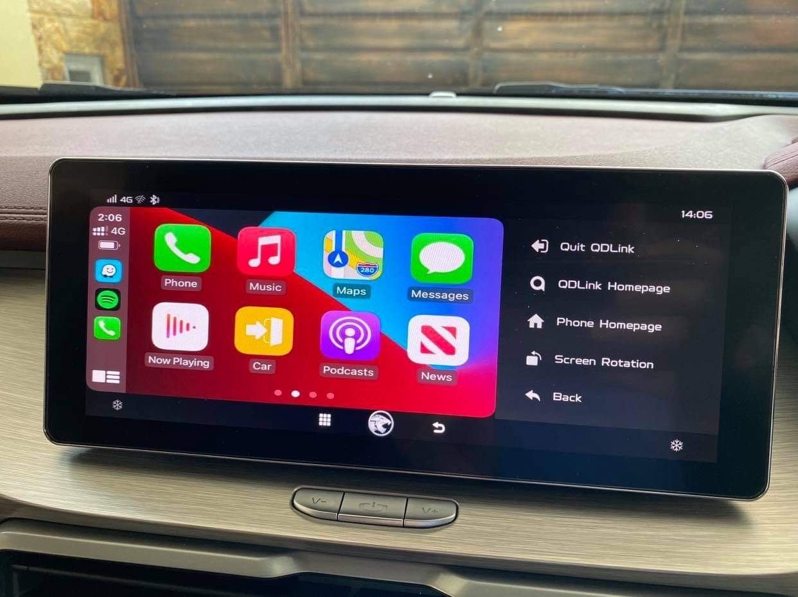

# CarplayX50 - Enable Wireless CarPlay for Proton X50, CoolRay
This project is an attempt to enable wireless carplay over qdlink. No sideload or firmware hack/mod/downgrading.

Your warranty is now NOT voided 😊 Until a better solution is found, this method may be the only way. Work in progress, may or may not release.

# What is working / what is not
Working:
- wireless carplay
- navigation apps(Waze, Gmaps)
- entertainment app(Spotify, Apple Music, Youtube, Netflix)

Not working:
- touch
- sound
- microphone* Currently using iOS device microphone

# Picture Progress

# Dongle
You will need a dongle that does wired/wireless carplay. These are easily found with different prices online. I got mine from tbao, zbox.
Usually premium dongle supports multiple kinds of mirroring, mine for example can do carplay, android auto & carlife(Baidu).

Why cant I install apk into my phone and just use it to carplay?
A: After extensive research, even if you have the apk, carplay requires hardware level emulation. Unless you have a PX6 or similar android head units(then you wont be here anyway), the apk will not work. I tried going down the rabbit hole to reverse engineer the dongle I have, TLDR, no you cannot just install an apk to enable carplay.

# Theoratically this will work
1. Use an android box
1. Use a phone
1. Use a dev board

Each of these will have its own pro and cons.

# Future work
1. Reverse the apk of qdlink, make the menu bar on the left disappear or at least shrink to only show icon.