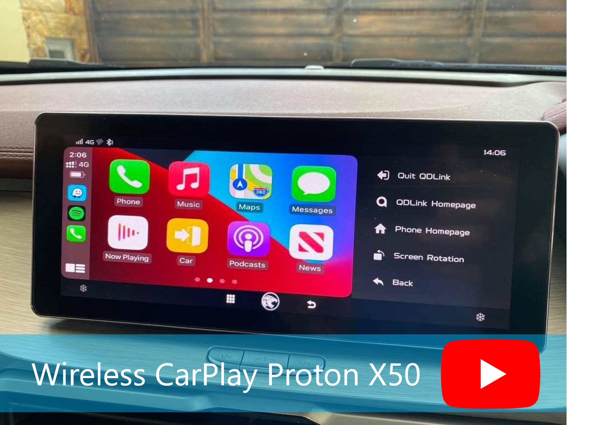
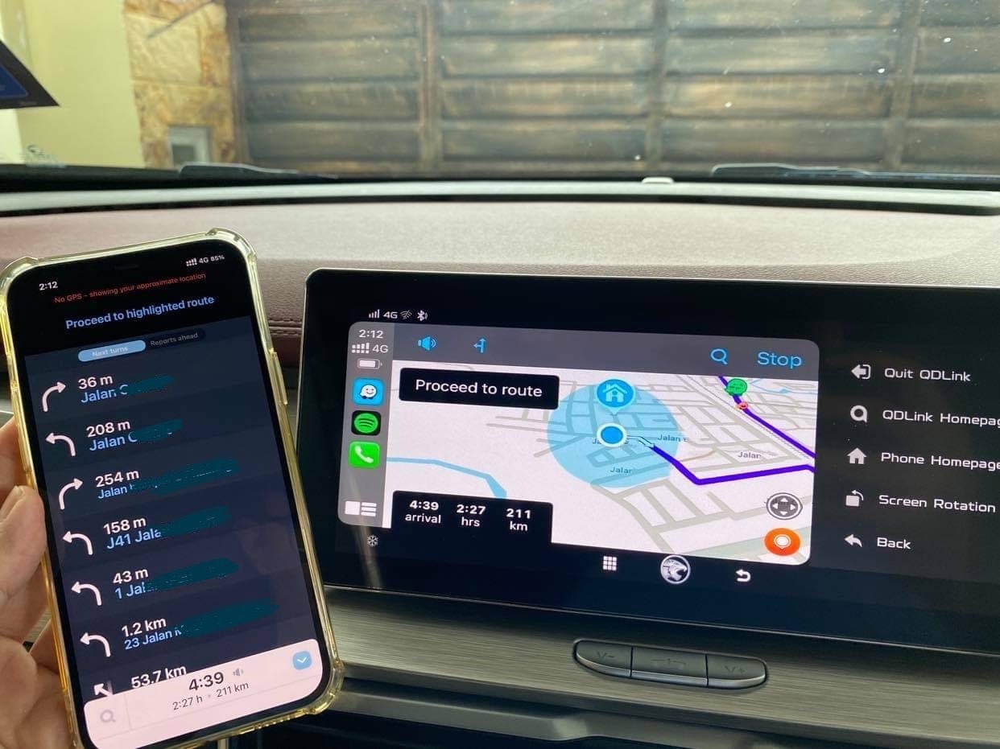

# CarplayX50 - Enable Wireless CarPlay for Proton X50, CoolRay
This project is an attempt to enable wireless carplay over qdlink. No sideload or firmware hack/mod/downgrading.

Your warranty is now NOT voided 😊 Until a better solution is found, this method may be the only way. Work in progress, may or may not release.

# 

# Requirements

## 1. Dongle
You will need a dongle that does wired/wireless carplay. These are easily found with different prices online. I got mine from tbao, zbox.
Usually premium dongle supports multiple kinds of mirroring, mine for example can do carplay, android auto & carlife(Baidu).

Why cant I install apk into my phone and just use it to carplay?
A: After extensive research, even if you have the apk, carplay requires hardware level emulation. Unless you have a PX6 or similar android head units(then you wont be here anyway), the apk will not work. I tried going down the rabbit hole to reverse engineer the dongle I have, TLDR, no you cannot just install an apk to enable carplay.

## 2. A device that runs android with multiple ports
Why do you need another android device? 

This is because iOS does not play nice with display mirroring. We need the android device as a medium, then plug in the wireless carplay/android auto receiver to the device.

Why do you need multiple ports?

This is because wireless receiver will take up one port, another port of the android device need to connect to headunit. You need a minimum of 2 ports.

# Tell me how, guide please?
1. Use an android box
1. Use a phone
1. Use a SBC(single-board-computer) dev board

Each of these will have its own pro and cons.

## Method 1: Android box

This method is the most stable I have tried. 

Android box I/O port MUST have client mode or host/client enabled. It needs to have ADB, MTP, PTP, USB tethering enabled, if not this wont work.

### How to check
Plug in USB-C, USB-A port to see if headunit recognize the device.

### What I tested
- Nvidia Shield TV 2017/2019 Pro. 
You need to enable USB client mode. After enable, use the [port furthest away from HDMI port](https://nvidia.custhelp.com/app/answers/detail/a_id/4367/~/how-to-use-the-new-shield-tv-in-mtp-or-adb-mode) to connect to the headunit.

Working:
- Wireless carplay/android auto
- Navigation apps(Waze, Gmaps)
- Entertainment app(Spotify, Apple Music, Youtube, Netflix)
- Sound* Kinda but very buggy

Not working:
- Touch
- Microphone* Currently using iOS device microphone

*Use remote control to navigate apps/menu

**There is a way to enable touch. You will need to buy a digitizer to register touch. Android cannot do mirror projection and touch at the same time.

### Guide
1. Get an android box with host & client port (at least 2 usb)
1. Install QDrive apk
1. Install wireless dongle apk
1. Plug in wireless dongle

## Method 2: Phone

This method is the way to go. Most stable, plug & play.

The phone needs to have TWO ports. One for headunit, one for wireless receiver.

List of phone/tablet in market that have 2 ports:
1. Asus [ROG Phone 3(2020)](https://rog.asus.com/sg/phones/rog-phone-3-model/), [ROG 5(2021)](https://rog.asus.com/event/ROG-Phone-5/)
1. Lenovo [Legion Pro/Duel(2020)](https://legion.lenovo.com/legion-phone-duel), [Legion Pro/Duel 2(2021)](https://news.lenovo.com/pressroom/press-releases/next-mobile-gaming-powerhouse-lenovo-legion-phone-duel-2/)

### What I tested
I tested on a rooted android phone that has one port. I thought USB dongle or USB hub will work, so I went & buy Anker type-C 100w PD hub with data & charging pass-through. It DOES NOT WORK. Don't bother to waste your time making hub work. I believe this is due to how host, client mode is configured. If the headunit does not detect a host, it wont work. The hub will forever be a client unless your hub somehow runs android & have a touchscreen.

I currently do not have any phone that have 2 ports for further testing.

### Guide
1. Get a phone with 2 ports.
1. Install QDrive apk
1. Install wireless dongle apk
1. Plug in wireless dongle

## Method 3: SBC RaspberryPi 4

Development board give you more flexiblity to play around & install different OS and hardware configuration to try. 

I am using a Raspberry Pi 4 with 8GB ram. I also have a touchscreen connected to it for easier debugging and maintenence. This [ETA Prime on Youtube](https://www.youtube.com/user/Mretaprime) have good reviews on SBC out there. Pick one that supports android if you are keen to try.

### What I tested
Lineage OS 16, 17.1, 18.1 will work just fine. 18.1 is the latest & smoothest from what I tested on Raspberry Pi 4.

I ran android 9, 10, 11 on my rpi4. I also have a touchscreen for debugging. Connecting to HDMI is somewhat troublesome testing in a car. I'm using the official rpi 7 inch screen, but anything would work as long as your sbc and the android OS supports it. 

Working:
- Wireless carplay/android auto
- Navigation apps(Waze, Gmaps)
- Entertainment app(Spotify, Apple Music, Youtube, Netflix)
- Sound* Kinda but very buggy

Not working:
- Touch
- Microphone* Currently using iOS device microphone

### Guide
1. Install android on SD card. ([Konstakang Lineage OS](https://konstakang.com/devices/rpi4/))
1. Put SD card into SBC.
1. Connect a touchscreen (optional but useful)
1. Install QDrive apk
1. Install wireless dongle apk
1. Plug in wireless dongle

# Future work
1. Reverse the apk of qdlink, make the menu bar on the left disappear or at least shrink to only show icon.